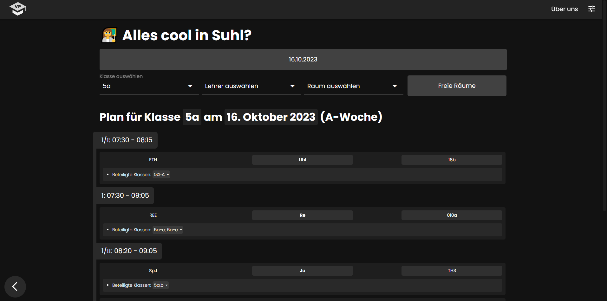

<a href="https://vplan.fr/">
    
</a>

# vplan.fr

This repository contains the code of the website [vplan.fr](https://vplan.fr/), which is free to use and already supports many schools in (eastern) Germany! If you want to contribute to the project, [contact us](https://vplan.fr/#contact), [submit an issue](https://github.com/vplan-fr/VPlan_FR/issues/new) or [fork this repo](https://github.com/vplan-fr/VPlan_FR/fork) and create a pull request for changes.



## Installation
To get started, install Python >= 3.11 and the requirements:
- `python3.11 -m pip install -r requirements.txt`

Next, install Node.js and the used packages:
- `cd client`
- `npm install --force`

MongoDB is also a requirement and needs the following collections:
- `users`
- `creds` which contains entries in the following format:
    - Credentials are optional
    - The endpoint is usually stundenplan24 but some schools host it on their own servers
```json
{
    "_id": "<school_number>",
    "display_name": "<display name>",
    "hosting": {
        "creds": {
            "students": {
                "username": "<username>",
                "password": "<password>"
            },
            "teachers": {
                "username": "<username>",
                "password": "<password>"
            }
        },
        "endpoints": "https://stundenplan24.de/<school_number>/"
    },
    "icon": "<school_number>.jpg",
    "school_number": "<school_number>",
    "short_name": "<short name>",
    "comment": "<optional comments>"
}
```

## Getting started
The plan crawler can be started with the following command:
- `python3.11 -m backend.load_plans`

To run the plan loader once instead of continuously, the flag `--once` can be set in the command above.

A `.env`  file has to be created in the project root, containing the following variables:
- `MONGO_URL=mongodb://<user>:<password>@<domain>/<database>`: MongoDB URL
- `WEBHOOK_TEST=<discord_webhook_url>`: Where webhooks get sent when Production is False
- `WEBHOOK_USER_CREATION=<discord_webhook_url>`: Message on user creation and deletion
- `WEBHOOK_SCHOOL_AUTHORIZATION=<discord_webhook_url>`: Message on school authorization
- `WEBHOOK_CONTACT=<discord_webhook_url>`: Message on contact
- `PRODUCTION=<True|False>`: If the current instance is being run in production or development

To start the website, start the flask server using:
- `python server.py`

and in another terminal, the npm dev server using:
- `cd client`
- `npm run dev`

If you have any more questions or need help with the setup, don't hesitate to [contact us](https://vplan.fr/#contact). :)
